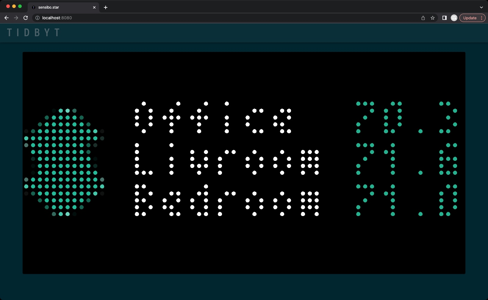
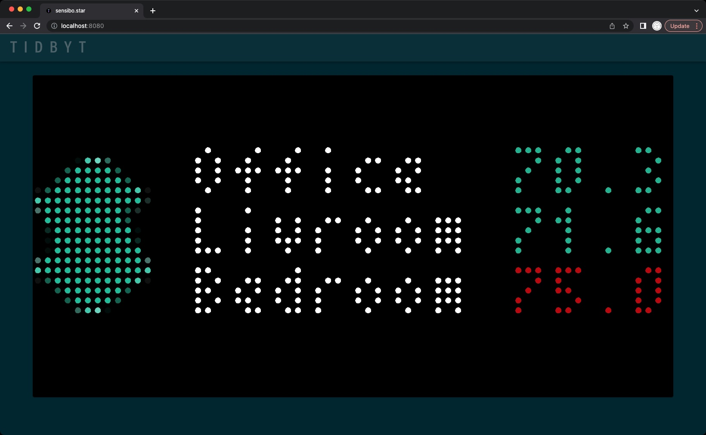
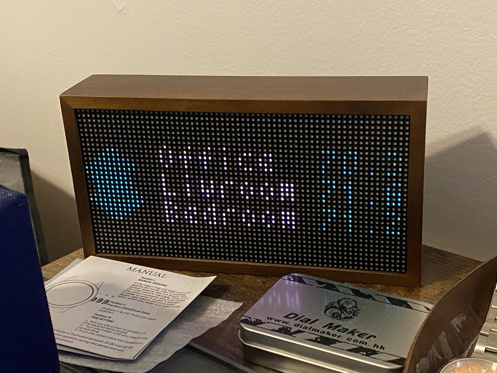

# Tidbyt-Sensibo

[Tidbyt](https://tidbyt.com/) integration with [Sensibo](https://sensibo.com/) devices. You simply need to replace API\_KEY in the URL with your key. See the [Sensibo API documentation](https://sensibo.github.io/#overview) for more info and [get a key](https://home.sensibo.com/login?next=/me/api).

The applet displays the Sensibo logo on the left, followed by the room names and temperatures. You can set a *hot temp* limit (default is 74f) so the number turns red if at or above the threshold. Degrees are in farenheit by default but can comment out the conversions if you want Celcius. The current layout is limited to five rooms.

| Room Temp | Hot Temp |
:-------------------------:|:-------------------------:
|  |  |

It is great having a quickview of room temperatures on a single screen. The API provides a lot of other data, so you could easily cycle through other information like humidity, timers, schedules, historical stats, etc.

